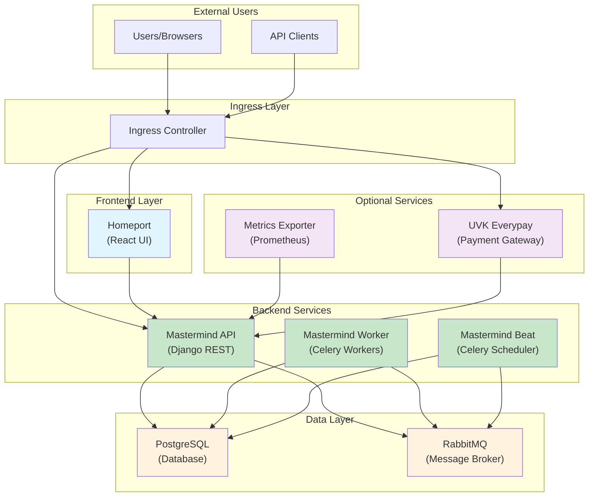
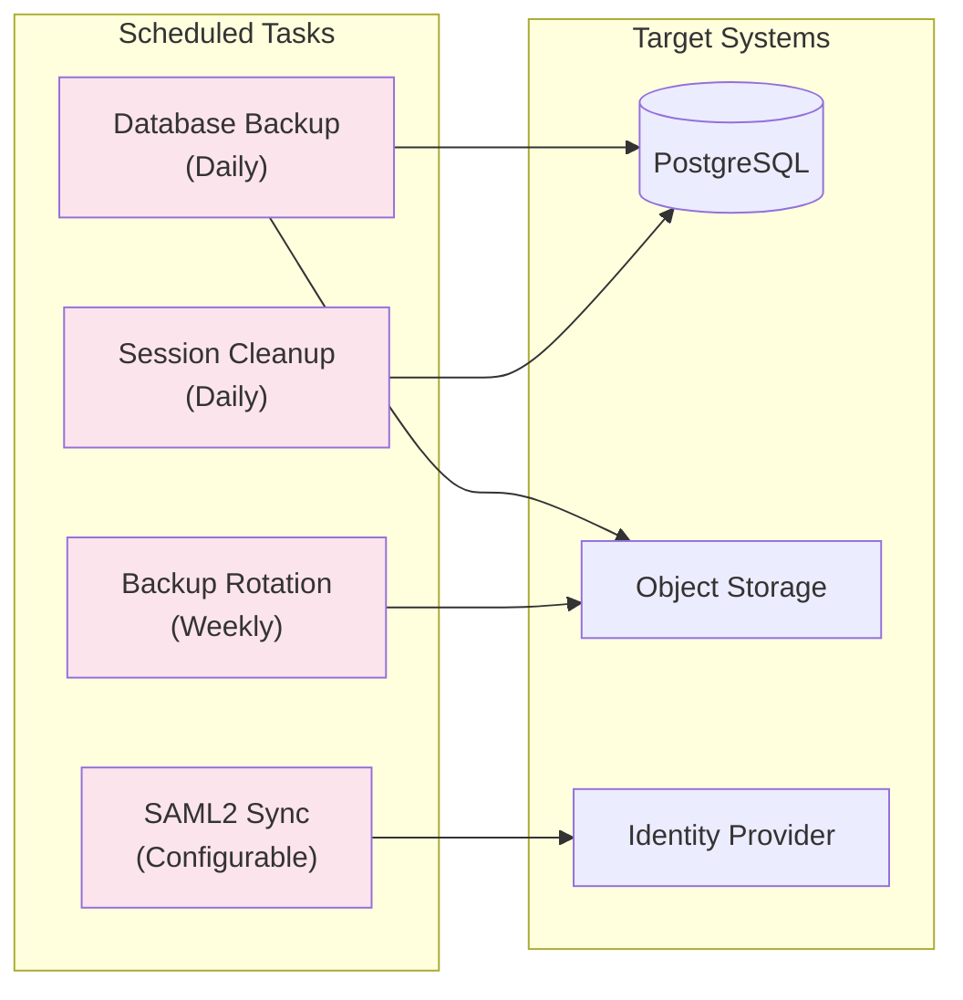
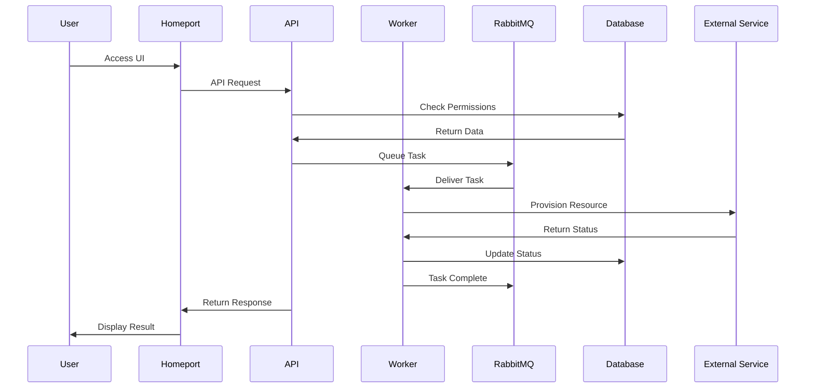

# Waldur Components Architecture

## Overview

Waldur is a cloud marketplace platform deployed on Kubernetes. This document
describes the main components launched by the Waldur Helm chart, their roles,
and how they interact with each other.

## High-Level Architecture

## Core Components

| Deployment | Purpose |
|------------|---------|
| `waldur-homeport` | React-based frontend UI for the cloud marketplace |
| `waldur-mastermind-api` | Django REST API backend handling all API requests, authentication, and resource orchestration |
| `waldur-mastermind-worker` | Celery workers processing background tasks, provisioning, and long-running operations |
| `waldur-mastermind-beat` | Celery scheduler managing periodic tasks, cleanup operations, and recurring jobs |

## Optional Components

### 5. Metrics Exporter

**Deployment:** `waldur-metrics-exporter`
**Container:** Prometheus metrics exporter
**Enabled by:** `waldur.metricsExporter.enabled`

- **Responsibilities:**
  - Exposes Waldur metrics in Prometheus format
  - Provides monitoring data
  - Integrates with monitoring stack

- **Configuration:**
  - Requires API token for authentication
  - Exposes metrics on port 8080

### 6. UVK Everypay Integration

**Deployment:** `waldur-uvk-everypay`
**Container:** Payment gateway integration
**Enabled by:** `waldur.uvkEverypay.enabled`

- **Components:**
  - Main container: UVK payment processor
  - Sidecar container: HTTP API bridge

- **Responsibilities:**
  - Processes payments through Everypay
  - Integrates with Azure AD
  - Handles payment notifications
  - Email notifications for transactions

## Dependencies

### PostgreSQL Database

**Chart:** Bitnami PostgreSQL v16.7.26
**Enabled by:** `postgresql.enabled`

- **Options:**
  - Simple PostgreSQL deployment
  - PostgreSQL HA deployment (using `postgresqlha.enabled`)
  - External database configuration

- **Purpose:**
  - Primary data storage
  - User accounts and permissions
  - Resource state management
  - Billing and accounting data
  - Audit logs

### RabbitMQ Message Broker

**Chart:** Bitnami RabbitMQ v16.0.13
**Enabled by:** `rabbitmq.enabled`

- **Purpose:**
  - Message queue for Celery
  - Task distribution to workers
  - Asynchronous communication
  - Event-driven architecture support

## Scheduled Tasks (CronJobs)

### Database Backup

**CronJob:** `cronjob-waldur-db-backup.yaml`
**Schedule:** Daily (configurable)

- Creates PostgreSQL dumps
- Uploads to object storage
- Configurable retention

### Backup Rotation

**CronJob:** `cronjob-waldur-db-backup-rotation.yaml`
**Schedule:** Weekly (configurable)

- Manages backup retention
- Removes old backups
- Maintains backup history

### Session Cleanup

**CronJob:** `cronjob-waldur-cleanup.yaml`
**Schedule:** Daily

- Cleans expired sessions
- Removes old audit logs
- Database maintenance tasks

### SAML2 Metadata Sync

**CronJob:** `cronjob-waldur-saml2-metadata-sync.yaml`
**Schedule:** Configurable

- Synchronizes SAML2 metadata
- Updates identity provider configurations
- Maintains SSO configurations

## Data Flow

## Service Communication

### Internal Services

- **waldur-mastermind-api:** ClusterIP service on port 80
- **waldur-homeport:** ClusterIP service on port 80
- **waldur-metrics-exporter:** ClusterIP service on port 8080
- **waldur-uvk-everypay:** ClusterIP service on port 8000

### External Access

- Ingress controller routes traffic to services
- TLS termination at ingress level
- Support for multiple hostnames per service

## Configuration Management

### ConfigMaps

- **api-override-config:** Django settings overrides
- **api-celery-config:** Celery configuration
- **mastermind-config-features-json:** Feature flags
- **mastermind-config-auth-yaml:** Authentication settings
- **mastermind-config-permissions-override-yaml:** Permission overrides
- **icons-config:** Custom icons and branding

### Secrets

- **waldur-secret:** Database credentials, API tokens
- **waldur-saml2-secret:** SAML2 certificates
- **waldur-valimo-secret:** Valimo authentication certificates
- **waldur-ssh-key-config:** SSH private keys
- **waldur-script-kubeconfig:** Kubernetes config for script execution

## High Availability Considerations

1. **API Layer:**
  - Supports multiple replicas
  - Horizontal Pod Autoscaling available
  - Load balanced through service

2. **Worker Layer:**
  - Horizontally scalable
  - Multiple workers can process tasks in parallel
  - HPA support for automatic scaling

3. **Beat Scheduler:**
  - Single instance only (by design)
  - Handles scheduling, not processing

4. **Database:**
  - PostgreSQL HA option available
  - Supports external managed databases
  - Regular backup strategy

5. **Message Queue:**
  - RabbitMQ clustering supported
  - External message broker option

